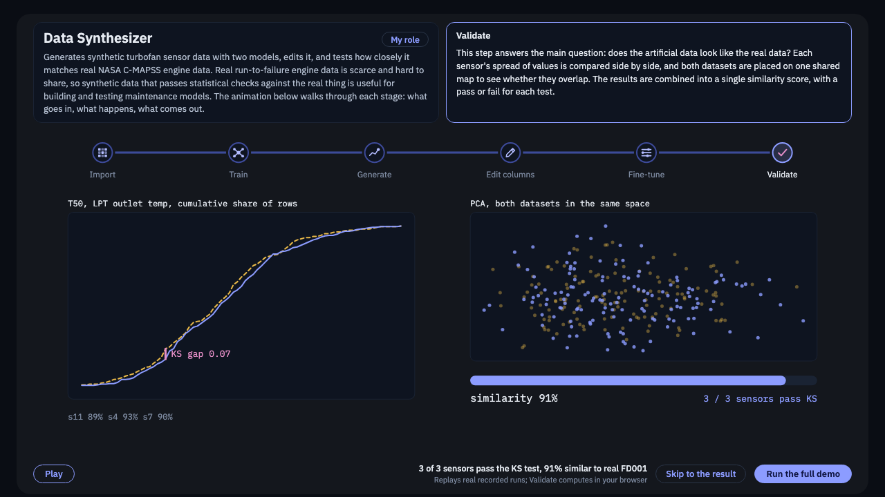

# Turbofan Data Synthesizer

**Making realistic, artificial jet-engine sensor data, and proving it looks like the real thing.**



## In one minute

Airlines and engine makers want software that predicts when an engine part will wear out. Building
that software takes lots of engine sensor data, but real data is scarce, expensive, and often
confidential. **Synthetic data** (artificial data that behaves like real data) can fill the gap,
but only if it is genuinely realistic.

This project:

1. **Learns** from real jet-engine sensor readings published by NASA.
2. **Generates** new, artificial readings with two kinds of AI model.
3. **Tests** the artificial readings against real ones with standard statistics.

**Result:** the best model's artificial data is statistically indistinguishable from the real data on
all three sensors tested (3 of 3 pass, 91% similarity). See [docs/results.md](docs/results.md).

## See it (no installation)

Open **`dashboard/index.html`** in any modern web browser. It is a single file that works offline.

- **Run the full demo** walks through the whole process in about 90 seconds.
- **Skip to the result** jumps straight to the final test (about 10 seconds).

Everything in the demo replays real recorded training runs of this code; nothing is made up.
The [dashboard guide](docs/dashboard-guide.md) explains every screen.

## How it works, in six steps

| Step | What happens, in plain words |
|---|---|
| 1. Import | Load real engine records: each row is one engine at one moment, with its sensor readings. |
| 2. Train | An AI model studies the real records until it learns what normal readings look like. |
| 3. Fine-tune | A small add-on (called LoRA) adjusts the trained model so its output matches the real data more closely. |
| 4. Generate | The model produces brand-new, artificial sensor readings. |
| 5. Edit (optional) | Adjust the artificial data, for example shift a sensor's values, to create test scenarios. |
| 6. Validate | Statistical tests compare artificial and real readings and give a pass or fail per sensor. |

More detail, still in plain language: [docs/how-it-works.md](docs/how-it-works.md).
Unfamiliar word? See the [glossary](docs/glossary.md).

## What is in this repository

| Folder | What it holds |
|---|---|
| `dashboard/` | The interactive demo (`index.html`) and the data it shows. |
| `src/` | The core code: the two AI models, the data-editing tools, and the statistical tests. |
| `api/` | A small local web server that connects the dashboard to the code, plus the script that recorded the demo's runs. |
| `data/` | The real NASA engine data and a sample artificial dataset. |
| `docs/` | Plain-English guides: how it works, results, glossary, dashboard guide, and setup. |

A file-by-file map: [docs/repository-guide.md](docs/repository-guide.md).

## For developers

Setup, training commands, tests and how to rebuild the dashboard's data are in
[docs/running-the-code.md](docs/running-the-code.md). Short version:

```bash
python3 -m venv .venv && source .venv/bin/activate
pip install -r requirements.txt
./run.sh            # starts the local server and opens the dashboard
```

## Background and credits

This began as a team project sponsored by Rolls-Royce through The Data Mine. This repository is a
curated personal copy: it contains the code, the public NASA data, and the demo. It does **not**
contain any data provided by the sponsor.

**My role (Undergraduate Data Science Researcher, Jan. 2025 – May 2026):**

- Refactored a transformer ML pipeline, externalizing 15+ hyperparameters into YAML configs with 6
  CLI flags for single command reproducible execution
- Built an auto-checkpointing system persisting model weights, optimizer state, and scheduler every
  5 epochs, enabling seamless training resumption after interruptions
- Designed a Streamlit frontend with a custom CSS design system wiring 3 backend ML modules to UI
  controls, supporting reactive data manipulation across interactive visualizations

**Data:** NASA C-MAPSS turbofan engine degradation simulation data set (FD001), from the NASA
Prognostics Center of Excellence. Reference: A. Saxena, K. Goebel, D. Simon and N. Eklund, "Damage
Propagation Modeling for Aircraft Engine Run-to-Failure Simulation," PHM 2008. See
[data/README.md](data/README.md).
